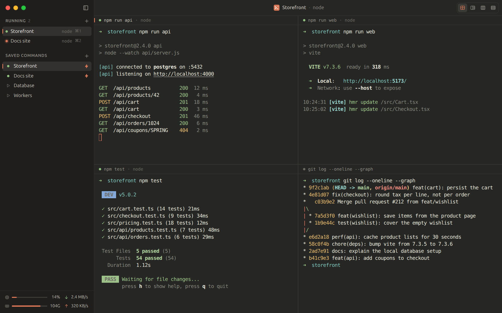

# Termi

[](https://github.com/JawadAhbab/termi/actions/workflows/ci.yml) [](https://github.com/JawadAhbab/termi/releases/latest) [](LICENSE)

A terminal app for macOS and Linux with a warm dark theme, saved commands that open several terminals side by side, and auto-start. Built with Electron, React, xterm.js and node-pty.



## What it does

- A sidebar with the running terminals at the top and your saved commands below.
- A saved command can run up to 4 terminals in one tab, for example an API server, a web server and a plain shell for one project. Add them with "Add terminal" in the saved command dialog. An empty command opens a plain shell. When a tab has more than one terminal, a layout control shows on the right of the header, and Termi remembers the layout for each saved command. Plain terminals always have one terminal per tab.
- Saved commands can start when Termi opens (the bolt icon).
- Select text in a terminal to copy it. A double-click copies a word, and a triple-click copies a line.
- The sidebar footer shows CPU use, memory use, and download and upload speed. Termi checks them every 1.5 seconds, and stops while the window is minimized.
- Termi reopens at the same window position and size. If that display is gone, the window moves to the main display.
- macOS keeps its own traffic lights in Termi's header. Linux gets drawn ones.

## Install

Download a release from [Releases](https://github.com/JawadAhbab/termi/releases). Each release has a `SHA256SUMS` file to check the downloads against.

**macOS.** `Termi-<version>-mac-arm64.dmg` for Apple silicon or `Termi-<version>-mac-x64.dmg` for Intel, or the `.zip` of either. Open it and drag Termi to Applications. The builds are not signed yet, so the first time, right-click Termi and choose **Open**, or run `xattr -dr com.apple.quarantine /Applications/Termi.app`.

**Linux.** On Debian and Ubuntu, install the deb with `sudo apt install ./Termi-<version>-linux-amd64.deb`. It sets up Chromium's sandbox, including an AppArmor profile on Ubuntu 24.04 and later. Elsewhere, use `Termi-<version>-linux-x86_64.AppImage`: make it executable with `chmod +x` and run it. On Ubuntu 23.10 and later an AppImage cannot bring its own AppArmor profile, so use the deb there.

## Run from source

Termi needs Node 24 (see `.nvmrc`) and the tools to build node-pty: the Xcode Command Line Tools on macOS (`xcode-select --install`), and `build-essential` and `python3` on Linux.

```sh
npm ci
npm run dev
```

`npm ci` also rebuilds node-pty for Electron. `npm run dev` serves the window's code from a dev server that reloads when you save. `npm start` builds Termi into `out/` and runs that build.

On Ubuntu 23.10 and later, the development copy of Electron needs an AppArmor profile to start its sandbox when you run it from a normal terminal (VS Code's terminal works without one). Once, with your checkout's path in place of `/path/to/termi`:

```sh
sudo tee /etc/apparmor.d/termi-dev > /dev/null <<'EOF'
abi <abi/4.0>,
include <tunables/global>

profile termi-dev /path/to/termi/node_modules/electron/dist/electron flags=(unconfined) {
  userns,
}
EOF
sudo apparmor_parser -r /etc/apparmor.d/termi-dev
```

## Tests and checks

Termi is written in TypeScript, with a React renderer, and built with electron-vite. CI runs all of these on Linux and macOS for every pull request, so run them before you open one:

```sh
npm run typecheck
npm run lint
npm run format:check
npm run test:scripts      # the changelog tool
npm test                  # unit tests
npm run test:integration  # the MCP server and real shells, after a build
npm run smoke             # the built app, end to end
```

The tests use a temporary data folder, never your real settings. `npm run smoke` opens a Termi window for a few seconds. On Linux without a display, run it as `xvfb-run -a npm run smoke`.

## Build the app

```sh
npm run dist:mac    # dmg and zip for arm64 and x64, on a Mac
npm run dist:linux  # AppImage and deb for x64, on Linux
```

Both write to `_releases/<version>/`. The macOS builds are not signed.

The logo is flat: one solid color, with no gradients or shadows. To change it, edit `assets/logo.svg` and `assets/logo-mark.svg`, which is the same logo without the outer padding, then run `npm run icons`. It needs `rsvg-convert` (`brew install librsvg` on macOS, `sudo apt install librsvg2-bin` on Ubuntu), and `iconutil`, which only macOS has, for the `.icns`.

## Releases

Releases are made by the Release workflow in GitHub Actions, never by hand. Run it from `main` and choose the bump. It opens a pull request from `release/v<version>` with the version bumped and a `CHANGELOG.md` section written from the commits since the last release. Merging that pull request runs CI on the merge commit, builds the macOS and Linux packages, then tags `v<version>` and publishes the GitHub Release with the packages and a `SHA256SUMS` file. The changelog groups commits by their Conventional Commits type, so every commit subject has to follow it, and CI checks that on each pull request.

## Shortcuts

| Action | macOS | Linux |
| --- | --- | --- |
| New terminal | ⌘T | Ctrl+T |
| Close terminal | ⌘W | Ctrl+W |
| New saved command | ⇧⌘N | Ctrl+Shift+N |
| Go to terminal 1 to 9 | ⌘1 to ⌘9 | Ctrl+1 to Ctrl+9 |
| Previous and next terminal | ⇧⌘[ and ⇧⌘] | Ctrl+Shift+[ and Ctrl+Shift+] |
| Previous and next pane in a split tab | ⌘[ and ⌘] | Ctrl+Alt+[ and Ctrl+Alt+] |
| Clear the terminal | ⌘K | Ctrl+K |
| Show or hide the sidebar | ⌘B | Ctrl+B |
| Text size | ⌘+, ⌘- and ⌘0 | Ctrl+=, Ctrl+- and Ctrl+0 |
| Open a link | ⌘ click | Ctrl+click |

On Linux, several of these share a key with the shell, such as Ctrl+W, which deletes a word, and Ctrl+K, which deletes to the end of the line. #8 moves them to the Ctrl+Shift keys other Linux terminals use.

Double-click a running terminal in the sidebar to rename it. In a tab with more than one terminal, closing the terminal closes the whole tab. To close one terminal, use the × in its pane header, or type `exit`.

## MCP server

`src/mcp/` is an MCP server for the saved commands. An AI assistant such as Claude Code can use it to list, add and edit them. `npm run build` bundles it into `out/main/mcpServer.js`, which runs on plain Node over stdio and has no dependencies.

| Tool | What it does |
| --- | --- |
| `list_saved_commands` | Lists every saved command with its id, name, terminal commands, folder, auto-start and layout |
| `add_saved_command` | Adds a saved command with 1 to 4 terminals |
| `edit_saved_command` | Changes a saved command, found by id or by name. Only the fields you give change |
| `get_termi_docs` | Returns the guide to the server. The same text is the `termi://docs` resource |

The guide is `src/mcp/docs.md`, and the build puts it inside the server. The server adds a reference to the end of it, built from the code: the layouts, every tool and parameter, and the paths this install uses. So the reference never goes out of date.

It follows the same rules as the saved command dialog. The first terminal needs a command, and a tab has at most 4 terminals. It writes to the same `settings.json` as the app. A running Termi watches that file, so a change shows in the sidebar right away, and the name of a running tab follows a rename.

To add it to Claude Code for all your projects, build Termi once with `npm run build`, then:

```sh
claude mcp add termi --scope user -- node /path/to/termi/out/main/mcpServer.js
```

`add_saved_command` and `edit_saved_command` change what runs later, including at launch through auto-start, and a command changed behind a button you already trust runs the next time you click it. So keep the assistant's calls to those two tools on manual approval. An assistant that reads untrusted text can be talked into planting a command.

## Where data is stored

Termi keeps its data in `~/Library/Application Support/Termi/` on macOS, and in `$XDG_CONFIG_HOME/Termi` on Linux, which is usually `~/.config/Termi`.

- `settings.json`: the saved commands, with their terminals and layout, the sidebar width and the text size. It has a version number, and Termi upgrades an older file when it reads it.
- `window-state.json`: the window's position and size.

Set `TERMI_USER_DATA` to point the app and the MCP server at another folder, for example for tests.

## Contributing

Bug reports, ideas and pull requests are welcome. [CONTRIBUTING](.github/CONTRIBUTING.md) covers everything from branch names to what a pull request needs, and [AGENTS.md](AGENTS.md) describes the code's layout and the rules that keep the page away from the shell. Issues labelled [good first issue](https://github.com/JawadAhbab/termi/labels/good%20first%20issue) are a place to start. Everyone taking part follows the [Code of Conduct](.github/CODE_OF_CONDUCT.md).

## Security

Report a vulnerability privately, never in an issue. [SECURITY](.github/SECURITY.md) says how and what counts.

## License

[MIT](LICENSE)
